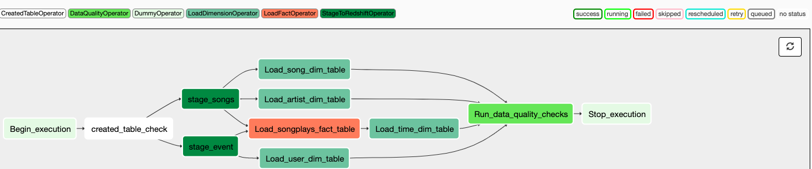

# Project: Airflow Data Pipeline
## Introduction Scenario
A music streaming company, Sparkify, has decided that it is time to introduce more automation and monitoring to their data warehouse ETL pipelines. They came to the conclusion that the best tool to achieve this is Apache Airflow.

They have decided to bring you into the project and expect you to create high grade data pipelines that are dynamic and built from reusable tasks, can be monitored, and allow easy backfills. They have also noted that the data quality plays a big part when analyses are executed on top the data warehouse and want to run tests against their datasets after the ETL steps have been executed to catch any discrepancies in the datasets.

The source data resides in S3 and needs to be processed in Sparkify's data warehouse in Amazon Redshift. The source datasets consist of JSON logs that tell about user activity in the application and JSON metadata about the songs the users listen to.

## Project Description
In this project, I was introduced to the core concepts of Apache Airflow. I created custom operators to perform tasks such as staging the data, filling the data warehouse, and running checks on the data as the final step.

## Project Datasets
I worked with two datasets. Here are the s3 links for each:

Log data: s3://udacity-dend/log_data

Song data: s3://udacity-dend/song_data

### Song Dataset
The first dataset is a subset of real data from the Million Song Dataset. Each file is in JSON format and contains metadata about a song and the artist of that song. The files are partitioned by the first three letters of each song's track ID. For example, here are filepaths to two files in this dataset.

song_data/A/B/C/TRABCEI128F424C983.json song_data/A/A/B/TRAABJL12903CDCF1A.json

And below is an example of what a single song file, TRAABJL12903CDCF1A.json, looks like.

{"num_songs": 1, "artist_id": "ARJIE2Y1187B994AB7", "artist_latitude": null, "artist_longitude": null, "artist_location": "", "artist_name": "Line Renaud", "song_id": "SOUPIRU12A6D4FA1E1", "title": "Der Kleine Dompfaff", "duration": 152.92036, "year": 0}

### Log Dataset

The second dataset consists of log files in JSON format generated by an event simulator based on the songs in the dataset above. These simulate app activity logs from an imaginary music streaming app based on configuration settings.

The log files in the dataset are partitioned by year and month. For example, here are filepaths to two files in this dataset.

log_data/2018/11/2018-11-12-events.json

log_data/2018/11/2018-11-13-events.json

## Schema for Song Play Analysis

## Airflow Operators

### Created Table Operator
The created table operator runs SQl create table commands for all tables including the staging tables. For all SQL create commands, a table is only created if the table doesn't exist already.

### Stage Operator
The stage operator loads any JSON or CSV formatted files from S3 to Amazon Redshift. The operator creates and runs a SQL COPY statement based on the parameters provided. The operator's parameters specify where in S3 the file is located and what target table the file will be loaded to.

The stage operator includes a templated field that allows loading timestamped files from S3 based on the execution time and backfills.

### Fact and Dimension Operators
The fact and dimension operators utilize SQL statements to perform transformations and load data to target tables. The dimension operator can be switched between delete-insert and append functionality. The fact operator has the same options although it's recommended to use the append option given that fact tables are usually significantly larger.

### Data Quality Operator
The data quality operator runs checks on the data. Currently the operator's only job is to see if the fact and dimension tables were loaded properly by which there's atleast one record. If not, the operator raises an exception and the task retries and fails eventually.

### DAG View

## Project Files
### dags/
- main_dag.py -- Initializes DAG, parameterizes operators and orders tasks by dependencies
- sql_queries -- SQL create and insert commands for fact and dimension tables
### plugins/operators/
- \_\_init\_\_.py -- Initializes operator directory as python packages 
- created_table_check.py -- Creates needed tables if they don't exist
- stage_redshift.py -- Stages S3 data in Redshift
- load_dimensions.py -- Loads S3 data into dimension tables
- load_fact.py -- Loads S3 data into fact table
- data_quality.py -- Checks if data was loaded properly into fact and dimension tables

 
